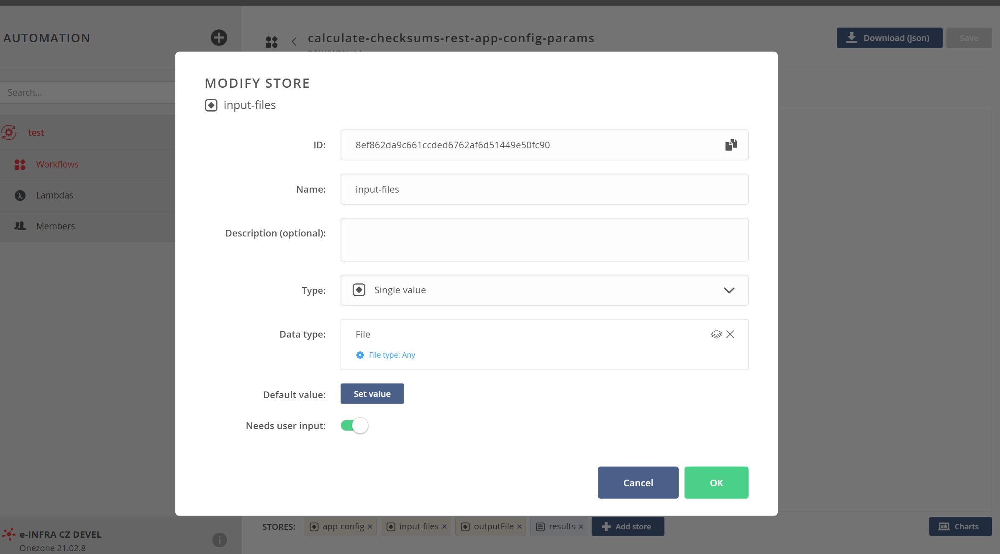
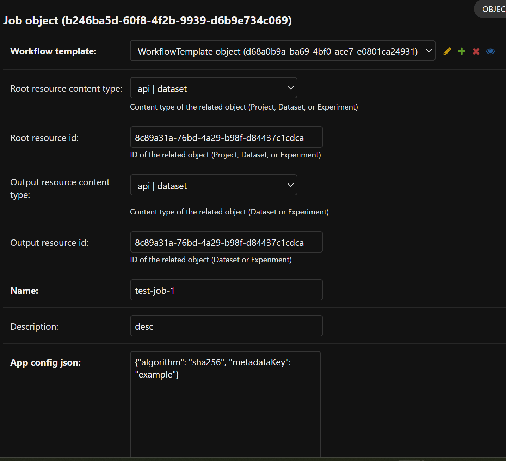

# Create your first job in DAREG
This text explains how to run your first job in the DAREG application using the `workflow-demo-hashes-of-the-files` workflow present in the repository. All the parameters on this page correspond to the `workflow-demo-hashes-of-the-files` workflow, so feel free to use them.


Prerequisites: Properly configured facility, project, and dataset (we will run a job on the dataset). Create the demo workflow in Onedata via JSON from the code repository.

## Configure your first workflow
Prepare: Take the workflow ID from Onedata where you want to create the workflow record in DAREG.

1. Configure the workflow ID from Onedata.
2. Configure the name and description.
3. Set the revision based on the workflow revision in Onedata.
4. Configure the input JSON. For the demo workflow, it is like:
``` 
{
  "appConfig": {
    "storeId": "cd644c29d451ad3eff2a03b828549b26b80162",
    "algorithm": "md5",
    "metadataKey": "checksum"
  },
  "appConfigDetails": {
    "algorithm": {
      "type": "string",
      "description": "Description of the algorithm param"
    },
    "metadataKey": {
      "type": "string",
      "description": "Description of the metadataKey param"
    }
  },
  "onedataInputStore": "8ef862da9c661ccded6762af6d51449e50fc90",
  "onedataOutputStore": "b3416eff41b9d7d0b2751d7f439a5995bfaa64"
} 
```
Values for onedataInputStore and onedataOutputStore can be found inside the workflow details in Onedata—the stores are the boxes at the bottom of the screen under the header 'Stores:'; see picture:

Configure the store ID also for appConfig.storeId.

Now let's configure the input parameters. Inside the nested appConfig JSON, put all the parameters your container is expecting with default values as field values (remember there is also storeId, corresponding to the store where the app config is expected to be uploaded). For all the input parameters, create a nested appConfigDetails JSON describing each parameter, including its type and a description of what the parameter stands for. To better understand the structure, see the example JSON above. The job will expect all the parameters to be configured according to the workflow.
5. Select the workflow type.

## Create your first job

1. Select the workflow you would like to use as a template to run the job.
2. Select the input object type—project, dataset, or experiment; in our case, it's dataset.
3. Provide the ID of the input object. In our case, the ID of the prepared DAREG dataset.
4. Select the output object type - dataset or experiment; in our case, it's experiment. This is the output where the results of the job will be stored.
5. Provide the ID of the output object.
6. Enter the name and description of the job.
7. Enter your appConfig JSON with all the parameters specified in the workflow. In our case:
```
{
    "algorithm": "sha256",
    "metadataKey": "hash_of_the_file"
}
```
8. Submit

Now the job is submitted. For this particular job it takes about two minutes to finish.