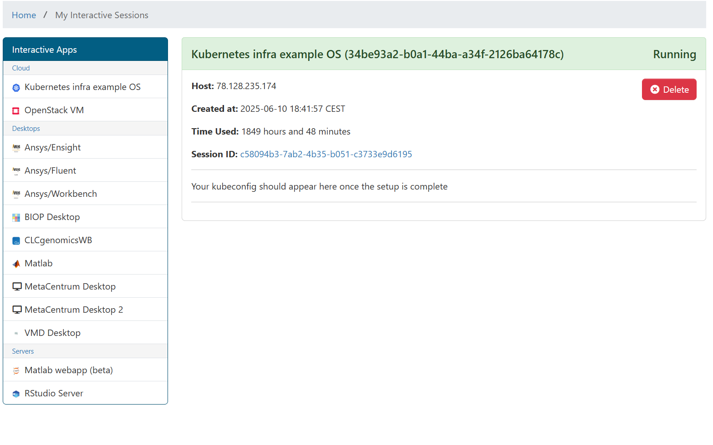
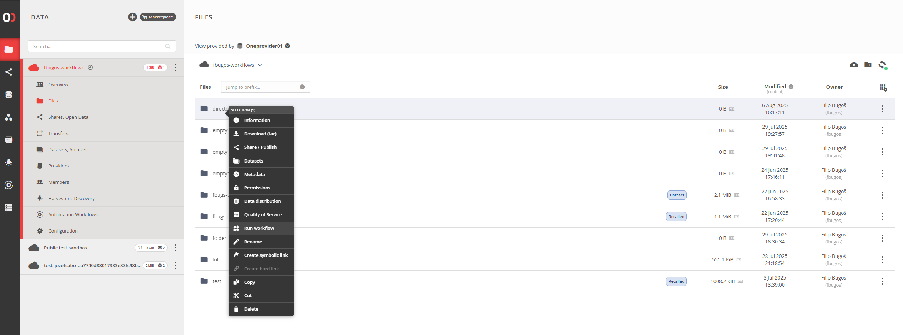

# Setup Workflows
This guidelines contains all the steps that are necessary for setting up workflows platform for DAREG application. It spans multiple areas, starting from infrastrcuture deployment and finishing with running simple workflow through admin UI of the DAREG.

## Setup infrastructure
Infrastructure spans two main areas - first is to deploy kubernetes cluster where jobs will run and second is to deploy onedata openfaas software there.

### Setup kubernetes cluster
Let's setup cluster where the workflow and openfaas will be running. In our case we are managing kubernetes on our own on openstack virtual machines - this will be eventually migrated to managed kubernetes(rancher).

1. Setup a project for you in openstack to have enough quota for creating virtual machines - 4 machines(2 for kubernetes CP and 2 for workers) should be enough.
2. Utilize the Open OnDemand internal tool https://ondemand-dev.metacentrum.cz/pun/sys/dashboard to deploy kubernetes do previously created project
    - open interactive apps tab and option Kubernetes infra example OS 
        - 
    - select a project to use(from step 1), put your ssh public key and number of nodes for CP and DP
    - click launch
    - after few minutes(30), an interactive session is created for you and the nodes(CP, DP and Bastion) are provisioned
        - 
3. Assign a public IP to the Bastion server(for deploying onedata openfaas via helm charts) and for workers(for onedata provider to have access to openfaas). Please note all VM's live within same network.
4. Configure network security rules for the nodes to make communication between them possible and between onedata provider and openfaas running inside kubernetes
    - CP -> Network security group with following rules
        - ```ALLOW IPv4 icmp from 0.0.0.0/0
            ALLOW IPv4 22/tcp from <network-cidr-of-all-nodes>
            ALLOW IPv4 tcp to 0.0.0.0/0
            ALLOW IPv4 udp from <network-cidr-of-all-nodes>
            ALLOW IPv4 udp to 0.0.0.0/0
            ALLOW IPv4 tcp from <network-cidr-of-all-nodes>
            ALLOW IPv4 6443/tcp from <network-cidr-of-all-nodes>
            ALLOW IPv4 80/tcp from 0.0.0.0/0
            ALLOW IPv4 8080/tcp from 78.128.247.103/32
            ALLOW IPv6 ipv6-icmp to ::/0
            ALLOW IPv4 tcp from 0.0.0.0/0
            ALLOW IPv4 6443/tcp from 0.0.0.0/0
            ALLOW IPv4 icmp to 0.0.0.0/0
            ALLOW IPv4 22/tcp from 0.0.0.0/0
            ALLOW IPv4 443/tcp from 0.0.0.0/0
            ALLOW IPv4 30000-32767/tcp from 78.128.247.103/32
            ALLOW IPv6 tcp to ::/0
            ALLOW IPv6 udp to ::/0```
    - workers -> Network security rules
        - ```ALLOW IPv6 tcp to ::/0
            ALLOW IPv4 30000-32767/tcp from <one-provider-cidr>
            ALLOW IPv4 8080/tcp from <one-provider-cidr>
            ALLOW IPv4 6443/tcp from <one-provider-cidr>
            ALLOW IPv4 tcp to <one-provider-cidr>
            ALLOW IPv4 443/tcp from <one-provider-cidr>
            ALLOW IPv4 30000-32767/tcp to <one-provider-cidr>
            ALLOW IPv4 80/tcp from <one-provider-cidr>
            ALLOW IPv6 tcp from ::/0
            ALLOW IPv4 icmp from 0.0.0.0/0
            ALLOW IPv4 22/tcp from <network-cidr-of-all-nodes>
            ALLOW IPv4 tcp to 0.0.0.0/0
            ALLOW IPv4 udp from <network-cidr-of-all-nodes>
            ALLOW IPv4 udp to 0.0.0.0/0
            ALLOW IPv4 tcp from <network-cidr-of-all-nodes>
            ALLOW IPv4 6443/tcp from <network-cidr-of-all-nodes>
            ALLOW IPv4 80/tcp from 0.0.0.0/0
            ALLOW IPv4 8080/tcp from 78.128.247.103/32
            ALLOW IPv6 ipv6-icmp to ::/0
            ALLOW IPv4 tcp from 0.0.0.0/0
            ALLOW IPv4 6443/tcp from 0.0.0.0/0
            ALLOW IPv4 icmp to 0.0.0.0/0
            ALLOW IPv4 22/tcp from 0.0.0.0/0
            ALLOW IPv4 443/tcp from 0.0.0.0/0
            ALLOW IPv4 30000-32767/tcp from 78.128.247.103/32
            ALLOW IPv6 tcp to ::/0
            ALLOW IPv6 udp to ::/0```
    - bastion -> network security rules
        - ```ALLOW IPv6 from default
            ALLOW IPv4 from default
            ALLOW IPv4 to 0.0.0.0/0
            ALLOW IPv6 to ::/0
            ALLOW IPv4 22/tcp from 0.0.0.0/0
            ALLOW IPv6 22/tcp from ::/0
            ALLOW IPv6 to ::/0
            ALLOW IPv4 from ssh
            ALLOW IPv4 to 0.0.0.0/0
            ALLOW IPv6 from ssh
            ALLOW IPv4 icmp from 0.0.0.0/0
            ALLOW IPv4 22/tcp from <network-cidr-of-all-nodes>
            ALLOW IPv4 tcp to 0.0.0.0/0
            ALLOW IPv4 udp from <network-cidr-of-all-nodes>
            ALLOW IPv4 udp to 0.0.0.0/0
            ALLOW IPv4 tcp from <network-cidr-of-all-nodes>
            ALLOW IPv4 6443/tcp from <network-cidr-of-all-nodes>
            ALLOW IPv4 80/tcp from 0.0.0.0/0
            ALLOW IPv4 8080/tcp from 78.128.247.103/32
            ALLOW IPv6 ipv6-icmp to ::/0
            ALLOW IPv4 tcp from 0.0.0.0/0
            ALLOW IPv4 6443/tcp from 0.0.0.0/0
            ALLOW IPv4 icmp to 0.0.0.0/0
            ALLOW IPv4 22/tcp from 0.0.0.0/0
            ALLOW IPv4 443/tcp from 0.0.0.0/0
            ALLOW IPv4 30000-32767/tcp from 78.128.247.103/32
            ALLOW IPv6 tcp to ::/0
            ALLOW IPv6 udp to ::/0```

### Openfaas instalation (source https://onedata.org/training/automation.html#5 slide 5-9)
1. Let's access bastion/worker via SSH from your local host
2. From the session information in https://ondemand-dev.metacentrum.cz/pun/sys/dashboard generate a kubeconfig(the info is in your session) in your bastion/worker
3. Check that kubectl works for you and you see nodes and DNS pods(some adjustment needs to be done here, gpt will help - Change config map of dns core to 8.8.8.8 or 1.1.1.1, restart deployment)
4. Change to some chosen working directory
5. Run git clone https://github.com/onedata/onedata-deployments.git
6. Change file openfaas/ansible/roles/common/tasks/main.yml to content -> so get rid of the docker install, kubernetes install and cluster setup. Setup just roles to existing cluster
    - ``` - name: A become=yes block
            become: yes
            block:
                - name: Install apt-transport-https, ca-certificates and python3-pip
                apt:
                    name: apt-transport-https, ca-certificates, python3-pip
                    state: present
                - name: Ensure permissions for ~/.docker
                file:
                    path: "{{ ansible_user_dir }}/.docker"
                    owner: "{{ ansible_user_id }}"
                    recurse: yes
                    mode: 0700
                - name: Install kubernetes python module
                pip:
                    name: kubernetes
                    state: present
                    extra_args: --break-system-packages
                - name: Install kubectl
                get_url:
                    url: https://dl.k8s.io/release/v1.30.0/bin/linux/amd64/kubectl
                    dest: /usr/local/bin/kubectl
                    mode: 0755

            - name: Check ClusterRoleBinding existence
            shell: kubectl get clusterrolebinding serviceaccounts-cluster-admin -o json
            register: clusterrolebinding_output
            ignore_errors: true

            - name: Print ClusterRoleBinding existence
            debug:
                msg: "ClusterRoleBinding already exists: {{ 'true' if clusterrolebinding_output.rc == 0 else 'false' }}"

            - name: Configure permissions for k8s
            shell: kubectl create clusterrolebinding serviceaccounts-cluster-admin   --clusterrole=cluster-admin   --group=system:serviceaccounts
            when: clusterrolebinding_output.rc
            - name: Download Helm installation script
            get_url:
                url: https://raw.githubusercontent.com/helm/helm/master/scripts/get-helm-3
                dest: /tmp/get_helm.sh
                mode: 0755

            - name: Run Helm installation script
            shell: /tmp/get_helm.sh
            become: yes
            args:
                creates: /usr/local/bin/helm

            - name: Verify Helm installation
            shell: helm version --short
            register: helm_output

            - name: Print Helm version
            debug:
                msg: "Helm version: {{ helm_output.stdout }}"```   
8. Edit ./group_vars/all.yaml with proper values. This section is just illustrative, add your own values
    - ```
        # Oneprovider hostname - should be accessible from the OpenFaaS host.
        oneprovider_hostname: oneprovider01.devel.onedata.e-infra.cz    # replace ??? with your Oneprovider subdomain label

        # IP address of the VM where OpenFaaS will be deployed.
        # Should be accessible from the Oneprovider host.
        openfaas_host: 78.128.235.174   # replace ??? with your vm ip - hint: hostname -i; worker public IP

        ...

        # Openfaas admin password
        openfaas_admin_password: <choose-your-password> # will be used later

        ...

        # pod-status-monitor will use this secret to authorize status reports sent to
        # Oneprovider, can be arbitrary.
        openfaas_activity_feed_secret: <choose-your-secret> # will be used later
        ```
9. Edit ./hosts with proper values. This section is just illustrative, add your own values
    - ```
        # This is the ansible inventory host file. Replace the IP
        # addresses accordingly.
        #
        # Both hosts specified here must have connectivity to each other:
        #  * Oneprovider contacts OpenFaaS to schedule jobs.
        #  * OpenFaaS contacts the Oneprovider to return job results.
        #  * Auxiliary machinery running on the OpenFaaS host report the activity and status
        #    of the cluster to the Oneprovider.


        [openfaas]
        # The host where openfaas will be deployed
        openfaas-vm ansible_host=78.128.235.174  ansible_connection=local # public worker IP
        [oneprovider]
        # The host where the Oneprovider service is already running
        # (ansible will adjust its configuration and restart it).
        oneprovider-vm ansible_host=147.251.255.78 ansible_user=<your-user-used-in-oneprovider-for-ssh, i.e. debian> # e.g. public IP of the one provider
      ```
10. Improve ./roles/provider-config/tasks/main.yml file to generate a config file for oneprovider in oneprovider machine
    - ```- name: Obtain openfaas password
            shell: |
                kubectl -n "{{openfaas_namespace}}" get secret openfaas-basic-auth -o jsonpath="{.data.basic-auth-password}" | base64 --decode
            register: kube_output

            - name: Place password in var
            set_fact:
                openfaas_admin_password: "{{kube_output.stdout}}"

            - name: Generate op-openfaas.config
            template:
                src: openfaas-config.j2
                dest: /home/debian/oneprovider_config/99-openfaas.config # this is destination file where oneprovider config will be produced; we will use that later```
11. Add SSH key of your machine where ansible is located(worker, bastion) to one provider so the ansible can perform step 10. make sure oneprovider is reachable at port 22.
12. Run 
    - ```cd onedata-deployments/openfaas/ansible/
        sudo apt install -y python3 python3-pip
        sudo python3 -m pip install ansible "Jinja2>=2.10,<3.1" jmespath kubernetes
        ```
    - or setup the prerequisities according this readme https://github.com/onedata/onedata-deployments/blob/master/openfaas/ansible/README.md 
13. Make sure all nodes can be connected via SSH
    - from bastion/worker to CP
    - from bastion/worker to oneprovider
    - from CP to oneprovider
14. Finally, run the ansible playbook via command ```ansible-playbook -i hosts site.yml```
15. Hopefully, everything goes well. Now check whether there is a config on oneprovider machine at path you specified in step 10. In case of the README, it's ```/home/debian/oneprovider_config/99-openfaas.config```. Make sure the file exists and move it to the appropriate folder, where oneprovider reads its configs. In case of our dev provider ```oneprovider01-devel-onedata-e-infra-cz``` the path for reading the config by oneprovider is ```/opt/onedata/oneprovider/persistence/etc/op_worker/config.d/```, so move the config there. The config looks like this(delete the comments):
    -```[
        {op_worker, [
            {openfaas_host, "78.128.235.174"}, # IP of your worker node
            {openfaas_port, 31112},
            {openfaas_function_namespace, "openfaas-fn"},
            {openfaas_admin_username, "admin"},
            {openfaas_admin_password, "your-password"}, # password you specified in step 8. under field 'openfaas_admin_password'
            {openfaas_function_constraints, []},
            {openfaas_function_labels, #{}},
            {openfaas_function_limits, #{}},
            {openfaas_function_annotations, #{}},
            {openfaas_function_requests, #{}},
            {openfaas_function_env, #{
                "read_timeout" => "604800s",
                "write_timeout" => "604800s",
                "exec_timeout" => "604800s"}
            },
            {openfaas_activity_feed_secret, "your-secret"} # secret you specified in step 8. under field 'openfaas_activity_feed_secret'
        ]}
    ]```
16. Restart one provider to reload the config.
17. If everything goes well, your oneprovider should enable button run workflow on a file as depicted in the picture.
    - 
18. You should see openfaas namespaces deployed to kubernetes cluster with some running pods.

### Run your first workflow manually via onedata UI
1. Configure the workflow as described here [Workflow Demo README](./workflow-demo-hashes-of-the-files/README.md).
2. Upload the workflow json in the workflow UI menu - upload json file
3. Right click on a file/folder and press 'Run Workflow' button.
4. COnfgure and run.
5. There should may be problems running the openfaas worker pod for the first time(the pod that actually does the job). In that case:
    - open by k9s your kubernetes 
    - TODO: edit secret Mutatingwebhookconfigurations by deleting last 4 characters - 'Cg=='
    - TODO: configure /etc/hosts
6. Now all your workflows should run properly

## TODO: Run your workflow utilizing OneData


